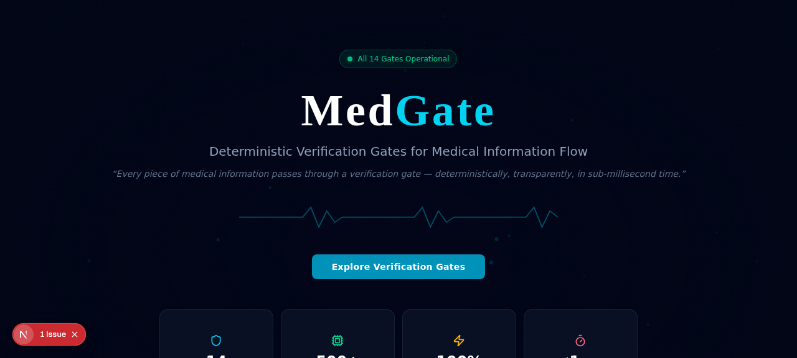

<p align="center"></p>

# MedGate

   

**A public local demo for medical safety verification workflows.**

MedGate is a claim-gated clinical safety interface for exploring how medical assertions, medication checks, dose calculations, lab ranges, vital signs, sepsis screens, blood compatibility, handovers, and incident workflows can be routed through explicit verification rules before they are presented as safe.

This repository is the **free local / open-source lite edition**. It is intended for product evaluation, developer testing, education, and integration demos. The paid JARVI3 deployment can embed MedGate inside the Packages Labs tab at `/medgate/`, alongside the other Gate apps.

> MedGate is not a medical device, clinical decision support product, diagnostic product, or substitute for professional judgement. Do not use this lite demo for patient care.

## Quick Start

Install Bun, clone the repo, then run:

```bash
cp .env.example .env
bun install --frozen-lockfile
bun run db:generate
bun run db:push
bun run dev
```

Open `http://localhost:3000`.

On Windows PowerShell:

```powershell
Copy-Item .env.example .env
bun install --frozen-lockfile
bun run db:generate
bun run db:push
bun run dev
```

## What You Can Try

- Medical claim verification with evidence labels and risk decisions.
- Medication interaction checks, dose calculations, lab range checks, and vital sign screening.
- Safety workflow demos for sepsis, contrast, pregnancy, pediatrics, anticoagulation, fall risk, VTE, smart pumps, surgical checklists, and incident review.
- Evidence pack, replay, benchmark, and audit-oriented panels for understanding what was checked.
- Local SQLite-backed persistence through Prisma for demo data.

## What This Lite Repo Is

- A local-first Next.js application.
- A demonstration of claim-gated medical safety UX patterns.
- A source-available integration target for JARVI3 deploys.
- A safe place to test the concept before paying for hosted/private monthly access.

## What This Lite Repo Is Not

- Not validated for clinical use.
- Not a regulated medical device.
- Not an EHR, eMAR, pharmacy, laboratory, radiology, or hospital production system.
- Not the full private JARVI3 engine, licensing layer, deployment controls, or enterprise support package.

## JARVI3 Integration

JARVI3 can embed this app from its Packages Labs tab via a same-origin iframe:

```text
/medgate/
```

The JARVI3 Railway Docker build can clone this public repository during deploy, install Bun dependencies, and proxy the Next.js app behind the main JARVI3 domain.

## Documentation

- [Local quick start](docs/LOCAL_QUICKSTART.md)
- [Safety and clinical-use boundary](docs/SAFETY.md)
- [JARVI3 upgrade path](docs/UPGRADE_TO_JARVI3.md)

## Ecosystem

Part of the public JARVI3 Gate ecosystem: ClaimGate, ClaimLint, UnitGate, EvidencePack, ReplayGate, ChipGate, OrbitGate, and MedGate.

**AI proposes. Gates verify. Unsafe claims do not pass silently.**
